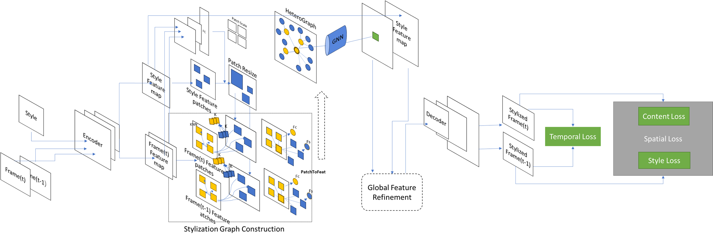
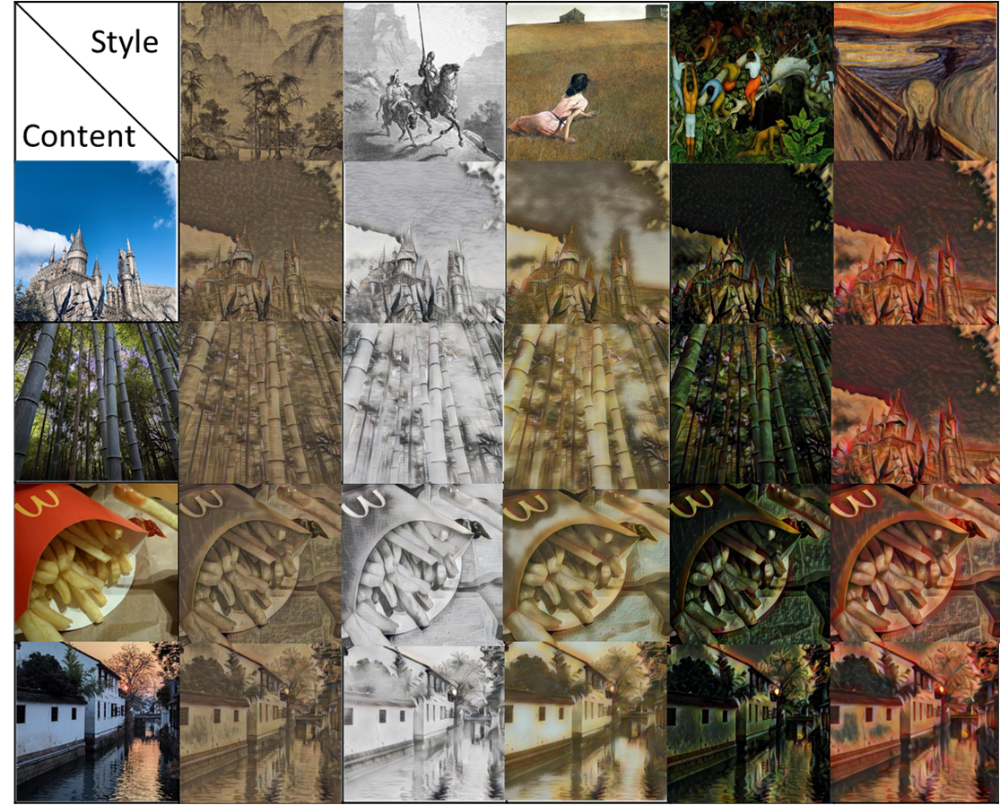
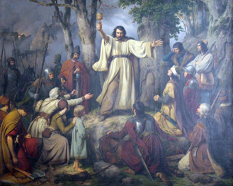
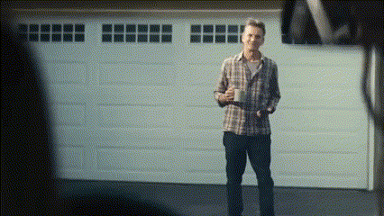
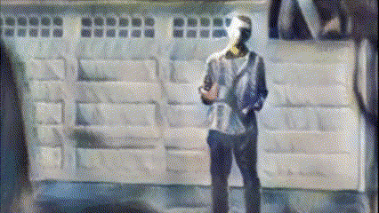
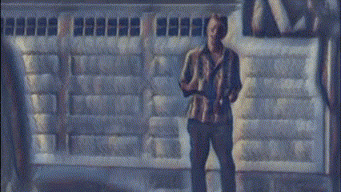

# Model Structure(For video Task)

It has several submodule

- Input:target Style Image & two consistent frames of video
- Image encoding module
-  local patch-based manipulation module 
   - Cut Patches and make Heterogeneous Patch Vertices
   
   -  Build Inter-Intra-KNN edges among Heterogeneous Patch Vertices.

   - Deformable graph convolution process to generate aggregated patches
   
- Patch To Image
- Loss(Temporal Loss & Spatial Loss)



# How to use

## Training Set
content: 
Image
```
wget -c http://images.cocodataset.org/zips/train2014.zip
```
Video Frames
```
wget -c http://data.csail.mit.edu/tofu/testset/vimeo_interp_test.zip
```
style:
```
pip install -U kaggle==1.5.3
kaggle competitions download -c painter-by-numbers -f train.zip
```
## Pyinn Installation
```
pip install git+https://github.com/szagoruyko/pyinn.git@master
```
## Compile
```
cd ops
sh ./make.sh
```
## Training
Image Task

```
python trainImage.py --style_weight 10.0 --conv gatconv --patch_size 4
```
Video Task
```
python trainVideo.py --style_weight 10.0 --conv gatconv --patch_size 4
```
Here is the link for pre-models and Best trained-models  [Models](
https://drive.google.com/drive/folders/1fBE7VixfRGDCU5vJ1CXgjAtxAxmJMVSp?usp=drive_link)

## Testing image
```
python test.py --conv gatconv --patch_size 4 
```
## Test video
```
python testVid.py --video_name xxx --style_video_name xxx --style_dir xxx
```
## GPU Resources
Please kindly note that our code needs at least 30 GB GPU memory to run. We used RTX 3080 when we trained and tested
It took 3 days for Image Task Training,1 day for Video Stask Training

## Acknowledgements
Our code is based on the wonderful work of [pytorch-AdaIN](https://github.com/naoto0804/pytorch-AdaIN) and [DPT](https://github.com/CASIA-IVA-Lab/DPT). We deeply appreciate their great codes!
# My Result
### Image

For Image task, I selected 4 content image and 5 style Image.Here is the result



### Video

**Style Image:**




**Raw video:**



**Stylized Video Without temporal loss:**



It didn't concern about temporal loss,causing too much flicker

**Stylized video with temporal loss** 

Adding time loss, greatly reduces flickering and is more consistent between frames


